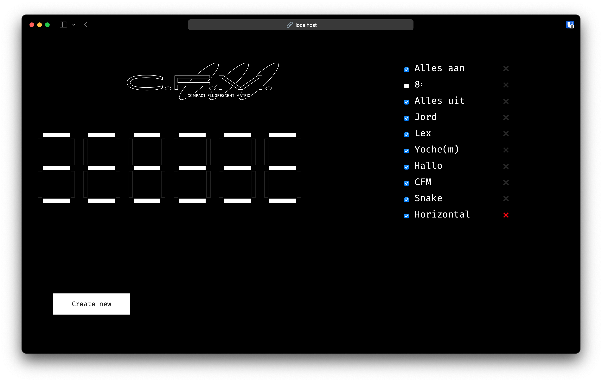

# Compact Fluorescent Matrix (C.F.M.)

Code for the Raspberry PI and Arduino controllers of the art project by
@jorddijkstra. This project is a matrix of 6 7-segment displays, build with
fluorescent beams. It's about 15 meters wide and 4 meters high, and it's
located at the Tramkade, Den Bosch.


## The C.F.M.

TODO


## Web UI



## Structure of the Project
```
.
├── arduino               # code for the arduino
├── public                # public files for web UI
│   ├── css
│   ├── img
│   └── js
├── scripts
│   ├── newpassword.go    # change web UI password
│   ├── update.sh         # git pull & upload code on arduino
│   └── upload-arduino.sh # upload code to arduino
├── templates             # gotmpl (html) files
├── artworks.json         # the database for artworks
└── main.go               # all RPI (server) code
```


## Workings

```
                              +-------------+
                              | DS3231 time |
                              +-------------+
                                     |
                                     | current time
                                     |
+---------------+                    v
|               |              +-----------+      --    --         --
|               |   artworks   |           |     |  |     |  |  |    |
| Raspberry Pi  |------------->|  Arduino  |---> |  |   --    --   --
|               |              |           |     |  |  |        |    |
|               |              +-----------+      --    --         --
+---------------+
    ^   |
    |   |
new |   | config UI / logs / current setup
art |   |
    |   v
 +-------------+
 |             |
 |             |
 |   Browser   |
 |             |
 |             |
 +-------------+
```

Current version of the C.F.M. shows randomly selected atworks (the checked
items in the list, as can be seen in the screenshot of the UI). The first 10
seconds of each minute it shows the time in hhmmss format. Via the create page
of the UI, new artworks can be designed and named. Because these are saved on
disk, they are still available after a reboot of the Pi. The Pi sends the
to-be-shown artwork via serial connection to the Arduino Mega as a long
bitstring (42 bits, each bit sets a beam on or off). The Arduino keeps the
time by itself. It decides when to show the time. There are also numerous
other commands that can be send via serial.

## License
MIT.
